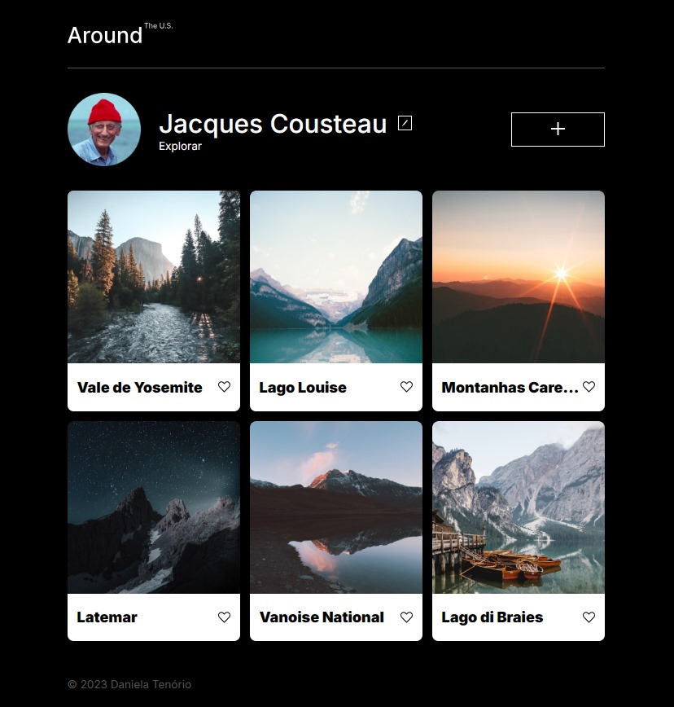

# Around US - Tripleten

Bootcamp de Desenvolvimento Web - TripleTen

  

- <a href="https://danniela-91.github.io/web_project_around/" target="_blank">Veja o projeto completo</a>

## 🚀 Tecnologias

Esse projeto foi desenvolvido com as seguintes tecnologias:

- HTML
- CSS
- Responsividade
- JavaScript
- Git e GitHub
- Metodoliga BEM

## 💻 Projeto

Nesse projeto da sprint 5, foi proposto criar uma página interativa onde os usuários podem adicionar, remover, ou curtir fotos.

## 🛠 Melhorias

Algumas melhorias que podem ser aplicadas:

- Animação em alguns elementos da página para deixar mais dinâmico e interativo
- Inserir posts em video
- Salvar alterações do usuário no browser

---

Feito com ♥ by Daniela Tenório
